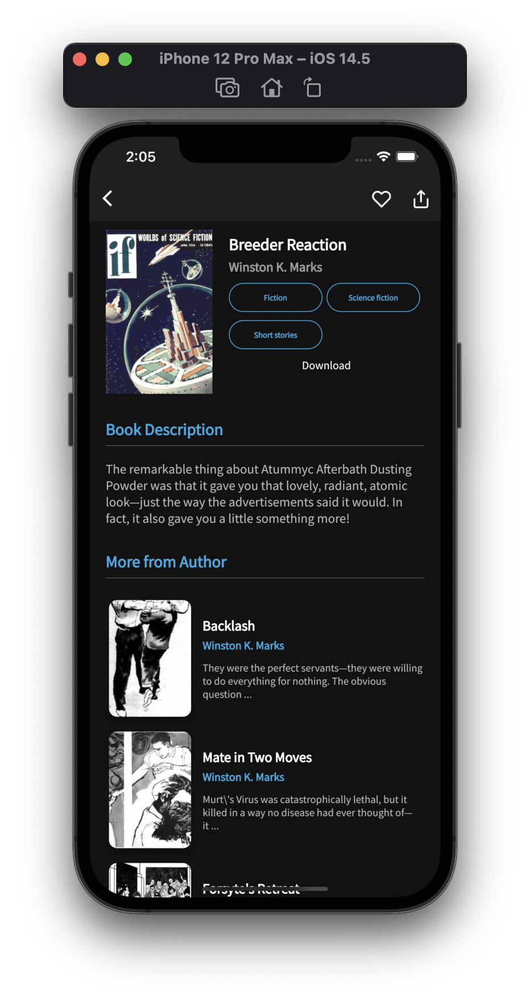

## Features

- [x] Download eBooks.
- [x] Read eBooks.
- [x] Favorites.
- [x] Dark Mode
- [x] Swipe to delete downloads.

##  ScreenShots

<!--  -->

| Light                             | Dark                              |
| --------------------------------- | --------------------------------- |
|   |   |
|   |   |
|   |   |
|   |   |
|   |  |

## 🔌 Plugins

| Name                                                    | Usage                                               |
| ------------------------------------------------------- | --------------------------------------------------- |
| [**Provider**](https://pub.dev/packages/provider)       | State Management                                    |
| [**Object DB**](https://pub.dev/packages/objectdb)      | NoSQL database to store Favorites & Downloads       |
| [**XML2JSON**](https://pub.dev/packages/xml2json)       | Convert XML to JSON                                 |
| [**DIO**](https://pub.dev/packages/dio)                 | Network calls and File Download                     |
| [**EPub Viewer**](https://pub.dev/packages/epub_viewer) | A flutter plugin for Folioreader to read ePub files |

